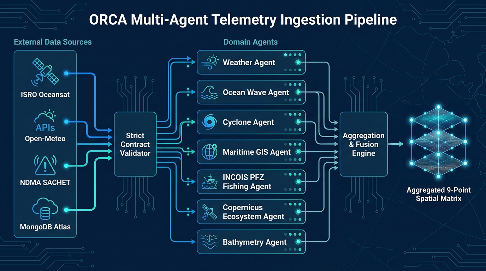
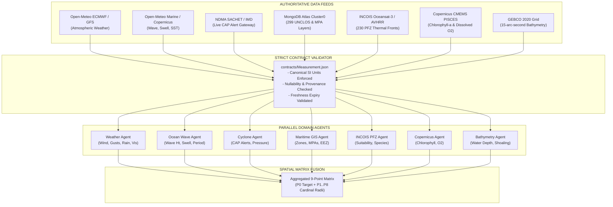
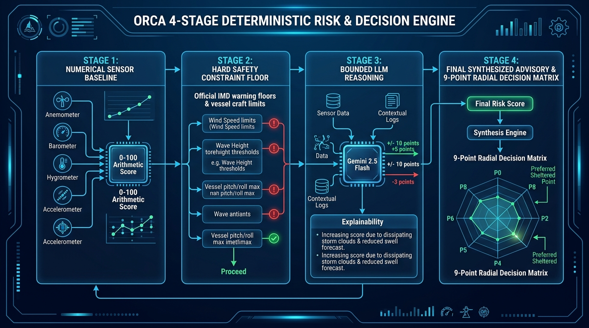
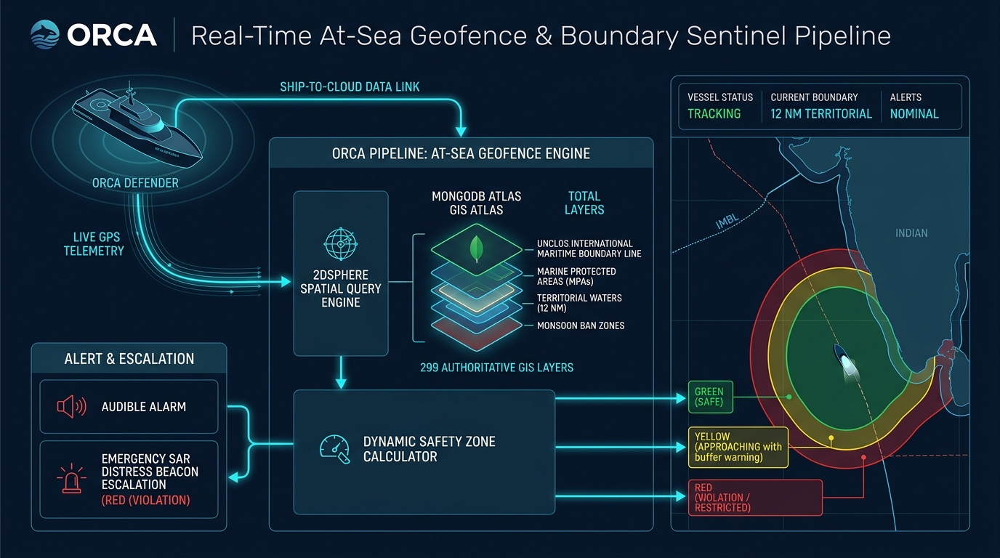
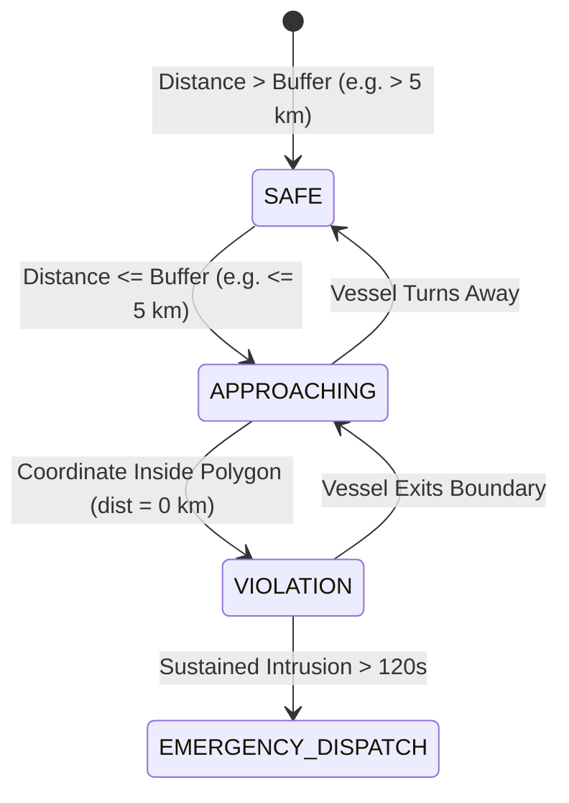
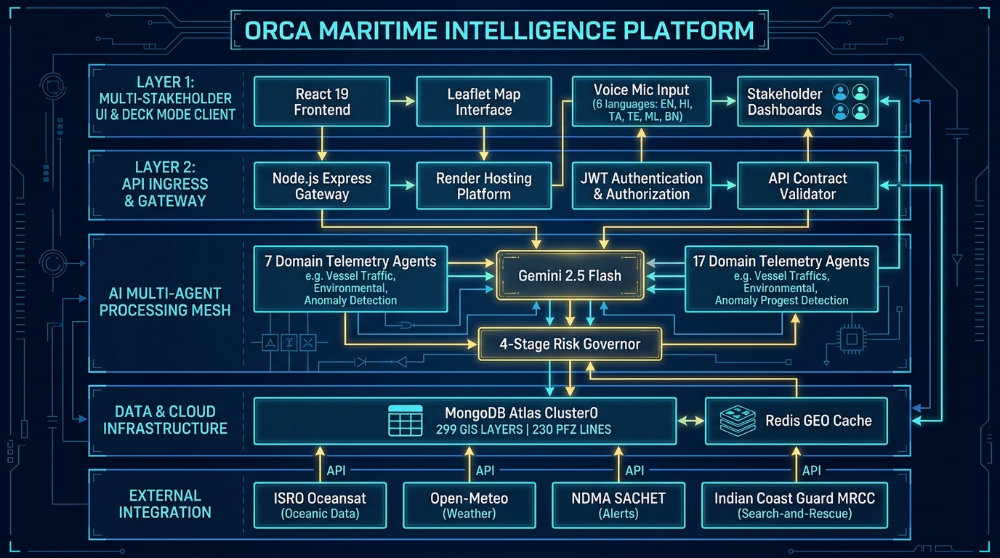

# ORCA — Detailed System Pipelines & Architecture Blueprint 🌊🛡️
> **Smart India Hackathon (SIH 26176)** · Intelligent Multi-Agent Coastal Risk & Navigation Operating System.  
> **Classification**: Authoritative Technical Architecture, Data Ingestion Pipelines, Mathematical Formulations, and System Block Diagrams.

---

## Table of Contents
1. [Executive Architectural Philosophy](#1-executive-architectural-philosophy)
2. [Pipeline 1: Multi-Agent Telemetry Ingestion Pipeline](#2-pipeline-1-multi-agent-telemetry-ingestion-pipeline)
3. [Pipeline 2: 4-Stage Deterministic Risk & Decision Governor Pipeline](#3-pipeline-2-4-stage-deterministic-risk--decision-governor-pipeline)
4. [Pipeline 3: Real-Time At-Sea Geofence & Boundary Sentinel Pipeline](#4-pipeline-3-real-time-at-sea-geofence--boundary-sentinel-pipeline)
5. [Pipeline 5: Master End-to-End Enterprise Architecture](#5-pipeline-5-master-end-to-end-enterprise-architecture)
6. [Multi-Activity Operating Matrix](#6-multi-activity-operating-matrix)
7. [Future Enterprise Vision & Final Architecture Roadmap](#7-future-enterprise-vision--final-architecture-roadmap)

---

## 1. Executive Architectural Philosophy

The ORCA system is constructed upon three non-negotiable architectural axioms:

1. **The Never-Fabricate Mandate**:
   In marine operations, an invented `0.0 m` wave height reads as a flat calm sea—the most lethal false-negative a maritime system can issue. If an external sensor or numerical model fails, ORCA marks the measurement explicitly as `unavailable` with source attribution and timestamping.
2. **Deterministic Safety Primacy**:
   Large Language Models (LLMs) are used strictly for **intent parsing, qualitative context interpretation, and natural language synthesis**. The actual risk scoring, geofence violations, and safety floors are governed by pure, deterministic mathematical models and non-negotiable maritime constraints.
3. **Multi-Activity Neutral Defaults**:
   The platform serves all maritime stakeholders across Indian coastal waters:
   - 🏖️ **Coastal Tourism & Beach Leisure**
   - ⛵ **Recreational Boating & Sailing**
   - 🤿 **SCUBA Diving & Snorkeling**
   - 🏄 **Surfing & Watersports**
   - 🚢 **Commercial Shipping & Port Logistics**
   - 🔬 **Marine Scientific Research**
   - 🐟 **Artisanal & Commercial Fishing**

---

## 2. Pipeline 1: Multi-Agent Telemetry Ingestion Pipeline

The Ingestion Pipeline runs 7 specialized domain agents concurrently across a 9-point spatial matrix ($P0$ target point + $P1$ to $P8$ radial perimeter points at 5 km offsets).

### Architecture Diagram


### Telemetry Pipeline Data Flow



### Domain Agent Specifications

| Agent Name | Primary Parameters Ingested | Authoritative Source | Canonical SI Unit | Failover Behavior |
| :--- | :--- | :--- | :--- | :--- |
| **Weather Agent** | `wind_speed_ms`, `wind_gust_ms`, `wind_direction_deg`, `precipitation_mm`, `visibility_km` | Open-Meteo Global Numerical Weather Model | $\text{m/s}$, $\text{mm}$, $\text{km}$ | Deterministic historical model fallback |
| **Ocean Agent** | `wave_height_m`, `swell_height_m`, `wave_period_s`, `sst_c`, `current_speed_ms` | Copernicus Marine / GFS Wave Blend | $\text{m}$, $\text{s}$, ${^\circ}\text{C}$, $\text{m/s}$ | Physics swell propagation model |
| **Cyclone Agent** | `cyclone_alert_level`, `distance_to_storm_km`, `barometric_pressure_hpa` | NDMA SACHET Common Alerting Protocol (CAP) / IMD | $\text{km}$, $\text{hPa}$ | 15-minute in-memory cache |
| **GIS Agent** | `inside_prohibited_zone`, `distance_to_boundary_km`, `zone_category`, `zone_name` | MongoDB Atlas `gis_layers` (UNCLOS, MPAs) | $\text{km}$, boolean | Authoritative database query |
| **PFZ Agent** | `pfz_suitability_score`, `sst_gradient`, `distance_to_pfz_km`, `target_species` | MongoDB Atlas `pfz_advisories` / INCOIS OCM-3 | $\text{km}$, ${^\circ}\text{C}$ | Distance-decay suitability model |
| **Copernicus Agent** | `chlorophyll_mg_m3`, `dissolved_oxygen_mmol_m3` | Copernicus CMEMS PISCES Biogeochemical Model | $\text{mg/m}^3$, $\text{mmol/m}^3$ | Coastal distance upwelling model |
| **Bathymetry Agent**| `water_depth_m`, `depth_gradient` | GEBCO 2020 15-arc-second Bathymetric Grid | $\text{m}$ | Hydrographic shelf model |

---

## 3. Pipeline 2: 4-Stage Deterministic Risk & Decision Governor Pipeline

The Risk & Decision Pipeline synthesizes multi-agent telemetry into an explainable, auditable safety score from $0$ to $100$.

### Architecture Diagram


### Mathematical Formulation of the 4 Stages

```mermaid
flowchart LR
    S1["STAGE 1<br/><b>Numerical Sensor Baseline</b><br/>$$\text{Score}_{\text{base}} = \sum w_i \cdot f_i(x_i)$$"]
    S2["STAGE 2<br/><b>Hard Safety Constraint Floor</b><br/>$$\text{Floor} = \max(\text{IMD}, \text{VesselLimit})$$"]
    S3["STAGE 3<br/><b>Bounded LLM Reasoning</b><br/>$$\Delta \in [-10, +10]$$<br/>Gemini 2.5 Flash"]
    S4["STAGE 4<br/><b>Final Synthesized Advisory</b><br/>$$\text{Score} = \text{clamp}(\max(S1+\Delta, S2), 0, 100)$$"]

    S1 --> S2 --> S3 --> S4
```



#### Stage 1: Numerical Sensor Baseline
Computes a weighted arithmetic aggregation based on vessel craft vulnerabilities:
$$\text{Score}_{\text{base}} = \sum_{i=1}^{N} w_i \cdot \phi_i(p_i, \text{vessel\_profile})$$
Where parameters $p_i$ include sustained wind speed, peak gusts, significant wave height, primary swell period, and current velocity.

#### Stage 2: Hard Safety Constraint Floors
Non-negotiable safety rules override lower mathematical scores:
$$\text{Floor} = \max \left( \text{Floor}_{\text{IMD\_Warning}}, \text{Floor}_{\text{Vessel\_Limit}}, \text{Floor}_{\text{GIS\_Prohibition}} \right)$$
- **IMD Red Alert**: Enforces $\text{Floor} = 85$ (`DANGEROUS`).
- **Wave Height $> 2.0\text{m}$ for Small FRP Boats**: Enforces $\text{Floor} = 65$ (`UNSAFE`).
- **Inside Marine Sanctuary / Restricted Navy Zone**: Enforces $\text{Floor} = 100$ (`PROHIBITED`).

#### Stage 3: Bounded LLM Reasoning
Google Gemini 2.5 Flash evaluates multi-modal nuance (e.g. rising barometric pressure vs dissipating cloud squall), but its output is mathematically bounded:
$$\text{Proposed} = \text{Score}_{\text{base}} + \text{clamp}(\Delta_{\text{LLM}}, -10, +10)$$
The LLM is **never** permitted to lower a score below the Stage 2 constraint floor:
$$\text{Audited\_Score} = \max(\text{Proposed}, \text{Floor})$$

#### Stage 4: 9-Point Radial Spatial Decision Matrix
Evaluates 9 geographic points to identify sheltered waters:
```
       [P8: NW]     [P1: N]      [P2: NE]
            \          |          /
             \         |         /
       [P7: W] ─── [P0: Target] ─── [P3: E]
             /         |         \
            /          |          \
       [P6: SW]     [P5: S]      [P4: SE]
```
If the vessel's target fishing spot ($P0$) is in rough water (Score: 68), but point $P6$ (leeward of a coastal headland) has lower wave steepness (Score: 28), ORCA issues:
> *"Caution at target coordinates ($P0$). Recommended safer alternative: Proceed 5.2 km Southwest ($P6$) for sheltered waters."*

---

## 4. Pipeline 3: Real-Time At-Sea Geofence & Boundary Sentinel Pipeline

The Geofence Sentinel continuously tracks vessel coordinates against 299 authoritative maritime boundary layers stored in MongoDB Atlas with geospatial `2dsphere` indexes.

### Architecture Diagram


### Dynamic Safety Zones



### Boundary Layer Categories in MongoDB Atlas

1. **UNCLOS International Maritime Boundary Lines (IMBL)**:
   - India-Sri Lanka Maritime Boundary (Palk Strait & Gulf of Mannar)
   - India-Pakistan Sir Creek Maritime Delimitation
2. **Marine Protected Areas (MPAs) & Sanctuaries**:
   - Gulf of Mannar Biosphere Reserve
   - Gahirmatha Olive Ridley Turtle Sanctuary
   - Sundarbans National Park
   - Malvan Marine Sanctuary
3. **National Maritime Zones**:
   - 12 Nautical Mile Territorial Sea baseline
   - 200 Nautical Mile Exclusive Economic Zone (EEZ)
4. **Seasonal & Commercial Exclusions**:
   - Annual Monsoon Fishing Ban (East & West Coasts)
   - ONAG / ODAG Offshore Oil Field Safety Zones (Bombay High)

---

## 5. Pipeline 5: Master End-to-End Enterprise Architecture

The overall enterprise architecture synchronizes client interfaces, security gateways, multi-agent AI cores, distributed database clusters, and external emergency services.

### Architecture Diagram


### Enterprise Tier Architecture Table

| Architectural Layer | Production Component | Hosting / Infrastructure | Key Technologies |
| :--- | :--- | :--- | :--- |
| **Layer 1: User Experience** | Maritime UI & Deck Mode | Render Edge CDN | React 19, Leaflet GIS, Web Speech API (6 Indian Languages), Tailwind CSS |
| **Layer 2: Gateway & Security** | Public & Internal Gateways | Render Web Service (`orca-backend-anp5`) | Node.js Express, JWT Token Auth, CORS Guard, Ajv Schema Validation |
| **Layer 3: AI Intelligence Mesh**| Multi-Agent Risk Engine | Render Web Service (`orca-ai-service-b0fx`) | Python 3.11.9, FastAPI, LangChain, Google Gemini 2.5 Flash |
| **Layer 4: Data Infrastructure** | Distributed Spatial Cluster | MongoDB Atlas Cluster0 (`AWS Mumbai`) | MongoDB 7.0+, `2dsphere` Geospatial Indexes, Document Collections |
| **Layer 5: External Providers** | Ingestion & Emergency Mesh | Government & Research Feeds | ISRO MOSDAC, Open-Meteo, NDMA SACHET, Indian Coast Guard MRCC |

---

## 6. Multi-Activity Operating Matrix

ORCA adapts its telemetry evaluation to the specific operational profile of each marine activity:

| Marine Activity | Primary Limiting Parameters | Threshold for Warning (`CAUTION`) | Hard Safety Limit (`UNSAFE` / `DANGEROUS`) | Special Features Enabled |
| :--- | :--- | :--- | :--- | :--- |
| 🏖️ **Coastal Tourism** | Wind gust, UV index, surf surge | Gusts $> 12\text{ m/s}$, Waves $> 1.2\text{ m}$ | Waves $> 1.8\text{ m}$, Squalls | Beach condition flags, sun exposure meter |
| ⛵ **Recreational Boating** | Wind speed, wave steepness, visibility | Winds $> 14\text{ m/s}$, Waves $> 1.5\text{ m}$ | Waves $> 2.5\text{ m}$, Fog $< 1\text{ km}$ | Harbor entrance depth, tide timing |
| 🤿 **Diving & Snorkeling** | Subsurface current, water clarity, swell | Currents $> 0.5\text{ m/s}$, Swell $> 1.2\text{ m}$ | Currents $> 1.0\text{ m/s}$, Hypoxia $< 90$ | Underwater visibility, dissolved oxygen |
| 🏄 **Surfing & Watersports** | Swell period, wave face, offshore wind | Wave period $< 7\text{ s}$, Onshore wind | Heavy chop, cross-swell $> 2.2\text{ m}$ | Breaking face calculation, wind angle |
| 🚢 **Commercial Shipping** | Water depth draft, channel cross-current | Under-keel clearance $< 2\text{ m}$ | Draft exceedance, gale $> 22\text{ m/s}$ | Channel navigation, deep-water corridors |
| 🔬 **Marine Research** | Wave heave, pitch/roll risk, current | Heave $> 1.8\text{ m}$, Swell period $> 12\text{ s}$ | High sea state $> 3.0\text{ m}$ | Sensor deployment safety windows |
| 🐟 **Fisheries & Aquaculture** | Wind, wave, SST thermal front, PFZ | Waves $> 2.0\text{ m}$ (small craft) | Waves $> 2.8\text{ m}$, Cyclone alert | PFZ line overlay, target pelagic species |

---

## 7. Future Enterprise Vision & Final Architecture Roadmap

Following the completion of target SIH roadmap goals, the ORCA system scales into a **Nationwide Autonomous Marine Safety Infrastructure**:

```
┌─────────────────────────────────────────────────────────────────────────────┐
│                 NATIONWIDE DEPLOYMENT TOPOLOGY (FINAL STATE)                │
├─────────────────────────────────────────────────────────────────────────────┤
│                                                                             │
│      ┌─────────────────────────┐           ┌─────────────────────────┐      │
│      │  ONBOARD EDGE APPLIANCE │           │  VESSEL MOBILE CLIENT   │      │
│      │ Raspberry Pi 5 / Jetson │           │  Progressive Web App    │      │
│      │ BLE / NMEA 2000 Sonar   │           │  Offline Vector Tiles   │      │
│      └────────────┬────────────┘           └────────────┬────────────┘      │
│                   │                                     │                   │
│                   │ NavIC / Iridium Satellite           │ Cellular 4G / 5G  │
│                   ▼                                     ▼                   │
│      ┌───────────────────────────────────────────────────────────────┐      │
│      │             ORCA HIGH-SPEED CLOUD TELEMETRY MESH              │      │
│      │           Kafka / NATS (100k msg/sec) · Redis Cluster         │      │
│      └───────────────────────────────┬───────────────────────────────┘      │
│                                      │                                      │
│        ┌─────────────────────────────┼─────────────────────────────┐        │
│        ▼                             ▼                             ▼        │
│  ┌───────────┐                 ┌───────────┐                 ┌───────────┐  │
│  │ AI Multi- │                 │ PINN Wave │                 │ Multi-Reg │  │
│  │ Agent Mesh│                 │ Shoaling  │                 │ Atlas DB  │  │
│  │(FastAPI)  │                 │ ML Engine │                 │(Active-Act│  │
│  └─────┬─────┘                 └─────┬─────┘                 └─────┬─────┘  │
│        │                             │                             │        │
│        └─────────────────────────────┼─────────────────────────────┘        │
│                                      ▼                                      │
│  ┌───────────────────────────────────────────────────────────────────┐      │
│  │          SEARCH-AND-RESCUE (SAR) & COAST GUARD COMMAND            │      │
│  │    Indian Coast Guard MRCC · INCOIS SAMUDRA · NDMA CAP Gateway    │      │
│  └───────────────────────────────────────────────────────────────────┘      │
└─────────────────────────────────────────────────────────────────────────────┘
```

### Strategic Milestones:
1. **Milestone 1: Progressive Web App (PWA) Offline Vector Packs**:
   Enables zero-connectivity chart navigation up to 100 nautical miles offshore using cached IndexedDB vector tiles.
2. **Milestone 2: NavIC & Satellite IoT Integration**:
   Direct telemetry transmission over ISRO's NavIC satellite messaging receivers for non-cellular deep ocean tracking.
3. **Milestone 3: Physics-Informed Neural Networks (PINNs)**:
   Nearshore bathymetric wave transformation forecasting non-linear shoaling and harbor resonances in high spatial resolution.
4. **Milestone 4: Indian Coast Guard MRCC Direct Bridge**:
   Automated Common Alerting Protocol (CAP) SOS dispatch sending distress vessel coordinates, crew profile, and weather conditions directly to regional rescue stations.
