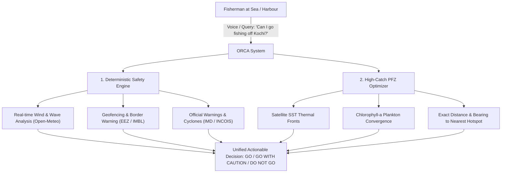

# 01: Project Overview, Mission & Goals

---

## 1. What is ORCA?

**ORCA** (**O**perational **R**isk & **C**atch **A**dvisory) is an advanced AI-powered marine decision-support and proactive safety platform built for Indian coastal waters.

Developed under the **Smart India Hackathon (SIH Problem Statement 26176)** for the **Ministry of Earth Sciences (MoES)** and **INCOIS (Indian National Centre for Ocean Information Services)**, ORCA bridges the gap between massive ocean satellite datasets and everyday coastal fishermen.

---

## 2. The Real-World Problem It Solves

India possesses an expansive **7,516 km coastline** with over **4 million coastal fishermen** operating more than **250,000 fishing vessels**. Every day, these fishermen face two critical challenges:

### Challenge A: The Life-Safety Crisis
1. **Unpredictable Marine Hazards:** Squalls, rogue waves, sudden wind shifts, and cyclonic depressions often develop rapidly in the Arabian Sea and Bay of Bengal. Small motorized and traditional craft have no onboard radar and are frequently capsized, resulting in hundreds of fatalities annually.
2. **International Maritime Boundary Drift:** Fishermen chasing fish schools off Gujarat (near Pakistan) or Tamil Nadu (near Sri Lanka) frequently cross the International Maritime Boundary Line (IMBL) without realizing it, leading to vessel seizures and prolonged arrests.
3. **Marine Protected Area (MPA) Incursions:** Incursions into ecologically sensitive coral reefs or turtle sanctuaries incur heavy penalties.

### Challenge B: The Economic Fuel Crisis
* Fishermen burn **60% to 70% of their operational budget on diesel fuel** searching blindly for fish schools across vast open waters.
* Even though INCOIS generates daily satellite maps of **Potential Fishing Zones (PFZs)**, traditional bulletins are published as static PDFs, complicated raster maps, or OGC web services that a fisherman cannot read or interpret on a mobile screen while bobbing at sea.

---

## 3. ORCA's Dual Mission

ORCA solves both problems simultaneously through a unified, voice-enabled, intelligent advisory:

---

## 4. The Core Design Principles

ORCA is engineered around three non-negotiable principles:

### Principle 1: "Never Fabricate" (Honesty Over Hallucination)
* In marine navigation, a hallucinated "calm weather" report can cost human lives.
* If a sensor or satellite feed is down, ORCA **never guesses**. It reports `status: "unavailable"` and explicitly informs the user that narrative interpretation was downgraded due to missing evidence.

### Principle 2: "Safety is Deterministic, Not Generative"
* Generative AI (LLMs like Google Gemini) is used **only** for natural language understanding and multilingual communication.
* The actual decision whether it is safe to sail is calculated by a **hardened, mathematical rule engine** (the Risk Evaluator). If wave heights exceed the safe limit for a specific boat type (e.g., $>1.8\text{ m}$ for a small motorized boat), the system strictly forces a `DO NOT GO` verdict. The LLM is mathematically forbidden from overriding safety rules.

### Principle 3: "Accessible to Every Indian Fisherman"
* **Voice-First & Vernacular:** Fishermen can speak in their native tongue (Hindi, Tamil, Malayalam, Telugu, Bengali, Odia, Marathi, Gujarati) using Bhashini AI.
* **Low-Bandwidth Resilient:** Returns lightweight JSON payloads so the app functions seamlessly even on weak 2G/3G mobile data off the coast.

---

## 5. Target User Personas

ORCA is customized for four distinct maritime operational tiers:

| Persona | Vessel Characteristics | Typical Range | Key Vulnerabilities & ORCA Value |
| :--- | :--- | :--- | :--- |
| **Traditional Non-Motorized Craft** | Catamarans, dugouts, row boats ($<8\text{ m}$) | Up to $5\text{ km}$ offshore | Extreme vulnerability to $1.2\text{ m}+$ waves. Needs early warning before leaving shore. |
| **Motorized Country Craft** | Fiber/wooden boats with outboard motors ($8-12\text{ m}$) | Up to $25\text{ km}$ offshore | Most common in India. Highly sensitive to rogue squalls and fuel waste searching for fish. |
| **Mechanized Trawlers / Longliners** | Inboard diesel engines, multi-day voyages ($12-25\text{ m}$) | Up to $100\text{ km}+$ (Deep sea) | High diesel consumption. Vulnerable to maritime boundary lines (IMBL) and cyclonic weather. |
| **Port Authorities & Coast Guard** | Patrol craft, shore monitoring towers | Coastal & EEZ monitoring | Needs fleet-wide geofencing audits and proactive alert broadcasts. |
