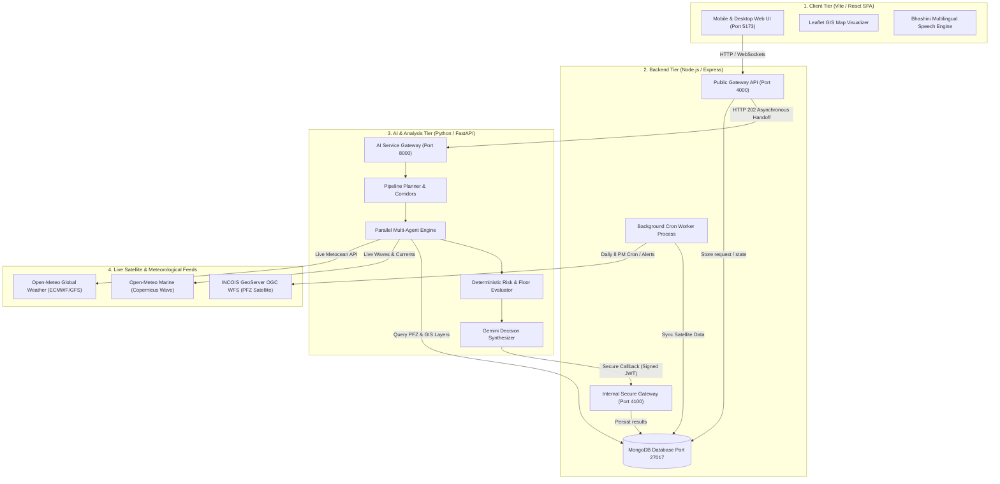
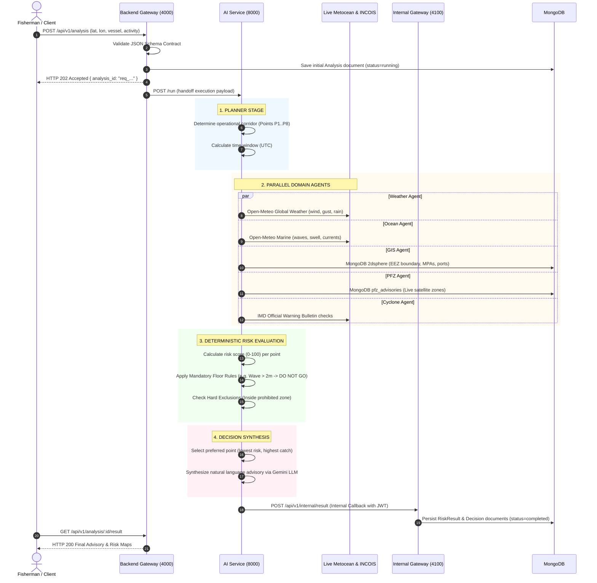

# 02: System Architecture & Processing Pipeline

---

## 1. High-Level Architecture Overview

ORCA is engineered as a decoupled, resilient, **three-tier asynchronous microservice architecture**:

---

## 2. Why This Architecture? (Key Design Decisions)

### Decision A: Separation of Public API and Internal Server
* **Public Gateway (Port 4000):** Handles user requests, rate limiting, authentication, geofencing queries, and public traffic.
* **Internal Gateway (Port 4100):** Only accessible inside the internal private network. Listens specifically for AI Service callback payloads (`applyProgress`, `applyResult`). Protected by short-lived signed JWT tokens (`INTERNAL_TOKEN_TTL_SECONDS = 120`) to prevent unauthorized result injection.

### Decision B: Asynchronous HTTP 202 Non-Blocking Lifecycle
Marine multi-agent analyses take between 2 to 15 seconds to fetch multi-point satellite feeds, calculate numerical wave physics, and query LLMs. 
* **Never block the HTTP socket:** If a mobile phone on a boat makes a request, a synchronous HTTP connection would easily time out over 2G/3G.
* **Instead:** The backend immediately validates the request in **5 milliseconds**, saves a stub in MongoDB, and replies with **`HTTP 202 Accepted`** and a unique `analysis_id`.
* The frontend then polls or receives real-time WebSocket progress updates (`status: "running" -> stage: "ocean" -> stage: "risk"`).

### Decision C: Separate Worker Process for Background Tasks
* Background alert evaluations and daily INCOIS synchronization run inside `src/worker.js`.
* **Why not inside the API server?** In cloud deployments, if the API server is horizontally scaled to 3 instances (replicas), having a cron inside the web server would cause all 3 instances to fire simultaneously—sending fishermen triplicate alerts and spamming INCOIS servers. A dedicated worker guarantees **exactly one scheduler**.

---

## 3. The Complete 4-Step Analysis Pipeline

Whenever a fisherman asks for an advisory, the AI Service executes the following four-stage pipeline:

---

## 4. The Multi-Agent System Breakdown

Inside `orca/ai-service/app/agents/base.py`, seven specialized domain agents operate concurrently:

| Agent Name | Primary Data Source | Core Parameters Monitored | Mandatory for Safety? |
| :--- | :--- | :--- | :---: |
| **`weather`** | Live Open-Meteo Weather API | Wind speed ($\text{m/s}$), Wind gusts, Wind direction, Visibility ($\text{km}$), Precipitation ($\text{mm}$). | ✅ **Yes** |
| **`ocean`** | Live Open-Meteo Marine API | Wave height ($\text{m}$), Swell height ($\text{m}$), Swell period ($\text{s}$), Ocean currents ($\text{m/s}$), SST ($^\circ\text{C}$). | ✅ **Yes** |
| **`gis`** | MongoDB `gis_layers` (2dsphere) | Distance to International Maritime Boundary ($\text{km}$), Marine Protected Area incursions, water depth ($\text{m}$). | ✅ **Yes** |
| **`cyclone`** | IMD Bulletins / Cyclone Warnings | Active storm depressions, cyclone alerts, gale warnings. | ✅ **Yes** |
| **`pfz`** | Live INCOIS GeoServer WFS | Distance to satellite fishing zone ($\text{km}$), target species, SST thermal gradient, chlorophyll convergence. | ℹ️ *Catch (Advisory)* |
| **`tide`** | Harmonic Tidal Engine | Tidal height curve, high/low water times, tidal streams. | ℹ️ *Navigation* |
| **`ecosystem`** | MOSDAC / Biochemical Models | Dissolved oxygen ($\text{mmol/m}^3$), chlorophyll-a ($\text{mg/m}^3$). | ℹ️ *Environmental* |

---

## 5. The Contract Validation System

ORCA uses **strict JSON Schema contracts** stored in `orca/contracts/`:
* **Zero drift guarantee:** The exact same `.json` schema files are validated by **AJV** in Node.js and **jsonschema** in Python.
* Any request or payload that does not match the exact contract shape is rejected immediately at the boundary with an informative HTTP 400 error detailing the missing or invalid property.
