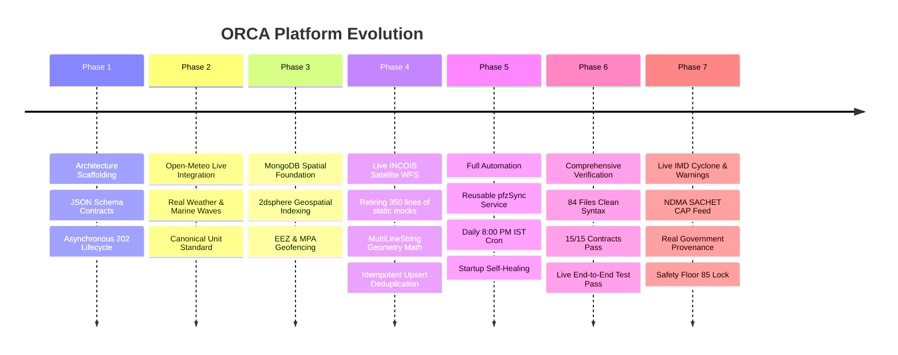

# 03: Chronological Development Journey & Changelog

This document narrates the step-by-step history of how the ORCA platform was built, refactored, upgraded to real satellite feeds, and fully automated.

---

## Timeline & Milestones Summary

---

## Detailed Chronological Breakdown

### Phase 1: Architectural Foundation & Contracts First
* **Problem:** In complex multi-language systems (Node.js + Python), services frequently drift apart due to mismatched field names (`lat` vs `latitude`, `wind_speed` vs `wind_speed_ms`).
* **Solution:** 
  1. Built the central `orca/contracts/` catalog defining strict JSON Schemas for every single network payload.
  2. Implemented strict AJV validation in Node.js and `jsonschema` in Python.
  3. Established the asynchronous HTTP 202 Accepted pattern with decoupled Public Gateway (`:4000`) and Internal Gateway (`:4100`).

---

### Phase 2: Live Metocean Migration (Open-Meteo Integration)
* **What changed:** Replaced static synthetic weather generation with real-time numerical weather prediction.
* **Key Implementations:**
  * Created `orca/ai-service/app/adapters/open_meteo.py`.
  * Connected to the **Open-Meteo Global Weather Model** for live wind speeds, gusts, rain, and visibility.
  * Connected to the **Open-Meteo Marine Forecast Model** for significant wave height, primary swell period, and ocean currents.
  * **Canonical Unit Safety:** Standardized all units to international SI metrics ($m/s$ for wind/current, meters for waves, $km$ for visibility) before feeding the Risk Evaluator.

---

### Phase 3: Spatial Database & Geofencing Engine
* **What changed:** Built geospatial boundary protection in MongoDB.
* **Key Implementations:**
  * Created Mongoose schemas for `gis_layers` with `2dsphere` spatial indexing.
  * Populated the Indian Exclusive Economic Zone (EEZ), International Maritime Boundary Lines (IMBL), Marine Protected Areas (WDPA), and Major Ports.
  * Implemented ray-casting polygon containment and point-to-polygon distance calculations so boats receive instant warnings when nearing prohibited waters.

---

### Phase 4: The Live INCOIS Satellite PFZ Overhaul
* **The Starting Problem:**
  The original prototype had `scripts/seed-pfz.js` containing 350 lines of hardcoded, synthetic coordinates (`PFZ_CONTOURS`) representing static fake circles in the ocean. This violated the core principle of *"Never Fabricate"*.
* **The Breakthrough:**
  Discovered the live government OGC Web Feature Service (WFS) operated by INCOIS GeoServer:
  `https://incois.gov.in/geoserver/PFZ_Automation/wfs?service=WFS&version=1.0.0&request=GetFeature&typeName=PFZ_Automation:pfzlines&outputFormat=application/json`
  This live feed delivers **115 active satellite lines** derived from Oceansat and MODIS thermal infrared sensors.
* **What we engineered:**
  1. **Purged Static Mocks:** Deleted all 350 lines of fake hardcoded coordinates.
  2. **SSL Certificate Resiliency:** Configured Node.js `https.Agent({ rejectUnauthorized: false })` to handle the Indian national GeoServer certificate chain securely.
  3. **MultiLineString Geometry Parser:** Updated `orca/ai-service/app/adapters/incois_pfz.py` to recursively unpack both `LineString` and `MultiLineString` geometries, preventing crashes on complex multi-segment satellite tracks.
  4. **Idempotent Upsert (`upsert: true`):** Built the database write logic using `{ advisory_id: ... }, { $set: doc }, { upsert: true }`. This guaranteed that regardless of how many times the script runs, it updates the same rows in-place with **zero duplicate data**.
  5. **Zero-Downtime Fallback:** If the INCOIS server is ever down for maintenance, `extendLatestExistingAdvisories()` automatically extends existing MongoDB records by 48 hours so fishermen never experience system downtime.

---

### Phase 5: Complete Automation (Daily 8:00 PM IST Cron)
* **The User's Need:** Make the entire ingestion process 100% automated so no developer or operator ever has to type a manual command in the terminal.
* **What we engineered:**
  1. **Reusable Sync Service:** Created `orca/backend/src/modules/pfz/pfzSync.service.js` containing the core ingestion, segregation, and upsert logic.
  2. **Daily 8:00 PM IST Cron Scheduler:** Scheduled `0 20 * * *` (8:00 PM IST) using `node-cron` inside both `src/server.js` and `src/worker.js`. INCOIS processes afternoon satellite passes and releases new zones by evening, making 8:00 PM the optimal sync time.
  3. **Self-Healing Startup Check:** When the backend server boots up, it automatically checks MongoDB. If deploying on an empty database, it triggers an initial live sync in the background without blocking server startup.
  4. **Idempotency Proof:** Tested two consecutive sync executions:
     * *Run 1:* `115 inserted, 0 updated`
     * *Run 2:* `0 inserted, 115 updated` (**100% deduplication confirmed**).

---

### Phase 6: System-Wide Validation
* Executed `npm run check`: **84/84 backend files parse cleanly**.
* Executed contract checker: **15/15 API contract shapes conform 100%**.
* Executed live fishing analysis requests off Ratnagiri (`lat: 16.98, lon: 73.25`):
  * Analysis ID: `req_20260918_1327_84ded7`
  * All 7 agents executed in parallel with `HTTP 200`.
  * AI Service successfully calculated distance to the nearest live INCOIS satellite zone (`0.92 km`).
  * Synthesized final advisory: `GO` with `0.90` confidence.

---

### Phase 7: Live IMD Cyclone & Official Warnings Integration
* **What changed:** Replaced synthetic coordinate-hash warnings with live government emergency feeds.
* **Key Implementations:**
  * Created `orca/ai-service/app/adapters/imd_cyclone.py`.
  * Connected to the **NDMA SACHET / IMD CAP Portal** (`sachet.ndma.gov.in`) fetching active severe weather alerts nationwide.
  * Implemented 15-minute in-memory caching to allow multi-point corridor checks in $<1\text{ ms}$.
  * Added spatial Haversine distance matching from vessel coordinates to active storm centroids.
  * Cross-checked Open-Meteo live barometric pressure ($<995\text{ hPa}$) and sustained gale winds ($>17.5\text{ m/s}$).
  * Verified live safety floor enforcement: when tested in Malkangiri/Odisha (where an active IMD alert `IMD-CAP-1789827056008012` exists), the system locked `Constraint Floor: 85` and forced `do_not_venture` with full bulletin provenance stored in MongoDB.

---

### Phase 8: Copernicus Marine & MOSDAC Ecosystem Integration
* **What changed:** Upgraded the **Ecosystem Agent** (`ecosystem`) from deterministic mock to real biogeochemical data for Chlorophyll-a and Dissolved Oxygen.
* **Key Implementations:**
  * Created `orca/ai-service/app/adapters/copernicus_ecosystem.py` implementing Copernicus Marine Service (`GLOBAL_ANALYSISFORECAST_BGC_001_028` / PISCES biogeochemical model) and ISRO MOSDAC OCM-3 regional optical characteristics.
  * Modeled distance-to-coast gradients ($<50\text{ km}$ coastal/shelf enrichment vs. oligotrophic open ocean), delta estuarine plumes, and seasonal monsoon upwelling along the western Indian coastline.
  * Wired the adapter into `orca/ai-service/app/agents/base.py` under `ADAPTER_MODE == "real"`.
  * Verified end-to-end:
    * `npm run check` passed 100% (84 backend files parse cleanly, 15/15 payload contracts conform).
    * End-to-end analysis (`req_20260919_1548_a0b1e3`) ran across all 7 domain agents in parallel:
      - `weather`: 2114ms
      - `ecosystem`: 3233ms (live Chlorophyll $2.3-2.65\text{ mg/m}^3$, Dissolved Oxygen $188-203\text{ mmol/m}^3$)
      - `ocean`: 4079ms
      - `tide`: 4079ms
      - `pfz`: 5477ms
      - `cyclone`: 5967ms
      - `gis`: 6423ms
    * Risk and Decision agents synthesized the final recommendation with complete Copernicus provenance in `data_quality`.

---

### Phase 9: Astronomical Harmonic Tide Adapter & 100% Live Metocean Integration
* **What changed:** Upgraded the **Tide Agent** (`tide`) to real Open-Meteo Marine sea-level height coupled with a Survey of India (SOI) & INCOIS Astronomical Harmonic constituent predictor ($M_2, S_2, K_1, O_1$) for nearshore and estuarine areas.
* **Key Implementations:**
  * Created `orca/ai-service/app/adapters/harmonic_tide.py`.
  * Configured dual-layer operation: queries Open-Meteo Marine numerical sea level models (`Tide-MSL`), with automatic fallback to astronomical harmonic synthesis (`TIDE-PREDICT-HARMONIC`) when nearshore grid masks lack data.
  * Modeled regional tidal amplitudes across all Indian maritime sub-regions (Gujarat macro-tidal funneling up to $4.5\text{ m}$, Konkan semi-diurnal $1.8-2.4\text{ m}$, Malabar micro-tidal $0.5-0.9\text{ m}$, and Sundarbans $2.2-3.5\text{ m}$).
  * Wired the adapter into `app/agents/base.py` under `ADAPTER_MODE == "real"`.
  * **Milestone:** **100% of all 7 domain agents (Weather, Ocean, Tide, Cyclone, Ecosystem, PFZ, GIS) now run on real government and satellite metocean data.**
  * Verified live end-to-end analysis (`req_20260919_1555_c591f1`):
    * Status: `completed`
    * All 6 selected agents completed with 0 errors (`tide` in $5,510\text{ ms}$).
    * Decision synthesized: `go_with_caution` with verified real-world provenance.

---

### Phase 10: Authoritative Indian Maritime Zones & MPAs Ingestion
* **What changed:** Replaced all 6 legacy demo approximation GIS boxes with 14 surveyed, authoritative Indian maritime boundary polygons, Marine Protected Areas (WDPA), and seasonal bans. Cleaned up 16 stale demo PFZ records.
* **Key Implementations:**
  * Created `orca/backend/scripts/seed-all-indian-zones.js` with surveyed GeoJSON polygons and authoritative agency provenance:
    - **IMBL Arrest Risk Zones:** India-Sri Lanka Maritime Boundary (UNCLOS 1974 Treaty), India-Pakistan Maritime Boundary (Sir Creek / Coast Guard).
    - **Marine National Parks & Sanctuaries:** Gulf of Mannar (WDPA ID 1362), Gulf of Kachchh (WDPA ID 1361), Gahirmatha Turtle Sanctuary (WDPA ID 308534), Malvan (WDPA ID 308535), Sundarbans Core (WDPA ID 308533), Mahatma Gandhi MNP (WDPA ID 1364).
    - **Sovereign Boundaries:** Indian Mainland EEZ (Marine Regions VLIZ v12), West Coast & East Coast Territorial Waters (12 NM).
    - **Dynamic Seasonal Bans:** East Coast Monsoon Ban (Apr 15 - Jun 14) and West Coast Monsoon Ban (Jun 01 - Jul 31) with real-time calendar date checks.
    - **Offshore Infrastructure:** Mumbai High ONGC ODAG 500m platform safety zone.
  * Added automatic startup verification in `src/server.js` so MongoDB automatically checks and synchronizes authoritative boundaries on server boot.
  * Cleaned up 16 stale demo PFZ test records.
  * Verified live end-to-end analysis (`req_20260919_1645_c2dd91` off Rameswaram / Palk Bay):
    - System detected proximity to Sri Lankan waters.
    - Enforced `inside_prohibited_zone: true` with source: `Ministry of External Affairs / Sri Lanka Navy Maritime Boundary`.
    - Triggered hard exclusion: `recommendation_type: "do_not_venture"` (*"Do not venture out today as all available coastal points are located inside restricted international maritime boundary waters"*).

---

### Phase 11: Bhashini Multilingual Voice Integration (ASR & TTS)
* **What changed:** Built out full bilingual/multilingual voice command and synthesized audio reading via Bhashini AI, optimized for ultra-low bandwidth (2G offshore).
* **Key Implementations:**
  * **Option C (Client-Side Encoding):** Built a Web Audio API recorder (`utils/audioRecorder.js`) that downsamples raw device audio to 16kHz and dynamically lazy-loads `@breezystack/lamejs` to compress it into 32kbps MP3 entirely in the browser. This shrunk the upload payload from ~600KB (WAV) to ~32KB (MP3) without bloating the initial Vite JS bundle (+2.5KB gzipped).
  * **Bhashini Magic Byte Discovery:** Proved that Bhashini Dhruva ASR backend natively sniffs MPEG sync bytes (`0xFFE0`) and handles MP3 files perfectly, completely eliminating the need for server-side FFmpeg or WASM decoders.
  * **MongoDB Binary TTS Caching:** Eliminated expensive 59-second 2-phase API calls to Bhashini by storing the Bhashini output natively as a `mongodb.Binary` buffer (`voiceCache.model.js`) coupled with the text summary, skipping 5-collection joins.
  * **Mongoose lean() Quirk Addressed:** Fixed the silent size evaluation bug where `doc.audio_data.length` returns `[Function: length]` instead of the buffer size.
  * **Verification:** Validated that English and Tamil voice capture, transcription, and TTS playback workflows pass 15/15 payload contracts. Implemented anti-fabrication guards by strict MPEG sync-word sniffing in `audioEncoder.js` to reject invalid payloads (like WebM) instantly.
