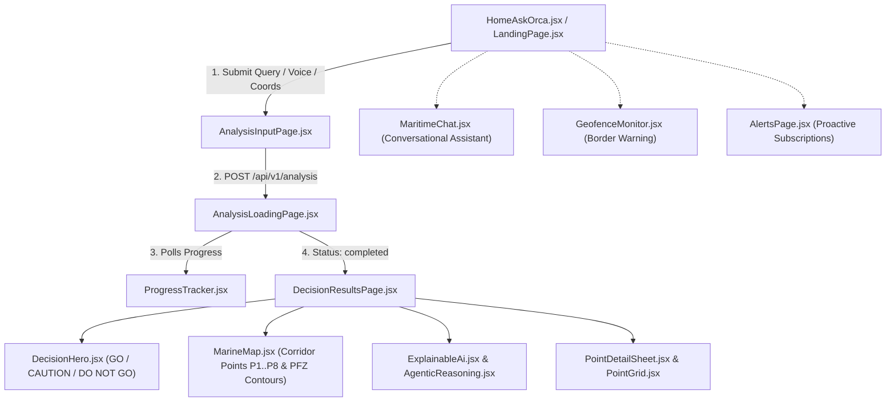

# 06: Frontend Codebase Deep Dive

This document provides a complete breakdown of the ORCA Single Page Application (SPA) located in `orca/frontend/`.

---

## 1. Technology Stack & Design Principles

* **Framework:** React 18 + Vite (lightning-fast HMR and bundle compilation).
* **Styling:** Tailwind CSS with responsive, mobile-first maritime color palette:
  * Safe / Go: Deep Emerald (`#059669`)
  * Caution: Marine Amber (`#d97706`)
  * Danger / Do Not Go: Crimson Coral (`#dc2626`)
  * Ocean Deep: Navy Slate (`#0f172a`)
* **Mapping:** Leaflet & OpenStreetMap tiles for lightweight, low-bandwidth satellite and vector layer rendering.
* **Speech & Internationalization:** Integration with Bhashini AI and browser Web Speech APIs for speech-to-text and audio readout in 8 Indian coastal languages.

---

## 2. Directory Structure

```text
orca/frontend/
├── index.html                 # HTML entry with viewport meta tags for mobile
├── package.json               # Frontend dependencies
├── vite.config.js             # Vite development server and build proxy
├── serve.js                   # Node production server hosting the built SPA (Port 5173)
└── src/
    ├── App.jsx                # Client-side router and state container
    ├── main.jsx               # React DOM root entry
    ├── api/                   # Centralized Axios API client functions
    ├── assets/                # Nautical icons and coastal assets
    ├── utils/                 # Coordinate formatters, unit conversions, translations
    └── components/            # 24 modular UI components
```

---

## 3. Core UI Components & User Flow



---

## 4. Key Component Breakdown

### 1. Landing & Input Experience
* **`HomeAskOrca.jsx`:** Conversational home interface. Offers one-tap prompt chips (*"Where is the nearest PFZ zone off Kochi?"*, *"Is it safe to fish off Ratnagiri today?"*) and real-time voice recording in native languages.
* **`AnalysisInputPage.jsx` & `QueryForm.jsx`:** Allows manual selection of:
  * Vessel Type: Traditional catamaran, motorized country craft, mechanized trawler.
  * Activity: Fishing, coastal transport, tourism, port operations.
  * Location: Automatically captured from browser GPS or selected on an interactive map.

### 2. Real-Time Execution Tracking
* **`AnalysisLoadingPage.jsx` & `ProgressTracker.jsx`:**
  * Displays a live animated progress card showing the agentic pipeline stages in real time:
    $$\text{Planner} \longrightarrow \text{Domain Agents} \longrightarrow \text{Risk Engine} \longrightarrow \text{Decision Synthesis}$$
  * Updates stage indicators dynamically as the AI Service completes each sub-agent pass.

### 3. Actionable Decision Dashboard
* **`DecisionHero.jsx`:** The large, high-visibility verdict badge (`GO`, `GO WITH CAUTION`, or `DO NOT GO`). Designed so a fisherman can understand their safety status at a single glance even in bright sunlight on open water.
* **`DecisionResultsPage.jsx`:** Comprehensive advisory dashboard displaying:
  * Primary safety recommendation and confidence score.
  * 3 key actionable findings (e.g., *"Prime fishing opportunity nearby: High-suitability PFZ (0.82) located 0.92 km away"*).
  * Sea surface temperature, wave height, and wind speeds.
  * Target fish species list.
* **`MarineMap.jsx`:** Interactive Leaflet GIS map visualizing:
  * The vessel's departure point and sampled corridor points ($P_1$ to $P_8$).
  * Color-coded risk markers (Green = Safe, Amber = Caution, Red = Hazardous).
  * Live INCOIS Potential Fishing Zone (PFZ) satellite contour lines.
  * International Maritime Boundary Lines (IMBL) and Marine Protected Areas.
* **`ExplainableAi.jsx` & `AgenticReasoning.jsx`:** Transparent evidence audit trail. Displays execution duration, status codes, and data sources for every single domain agent, reinforcing trust with maritime authorities.

### 4. Safety & Boundary Monitoring
* **`GeofenceMonitor.jsx`:** Continuous GPS monitoring interface. Warns the captain when approaching within $5\text{ km}$ of international borders or marine sanctuaries, displaying distance and bearing to the nearest boundary.
* **`AlertsPage.jsx`:** Proactive subscription center where fishermen can register their mobile numbers or browsers for automatic high-wave and cyclone warning alerts.
* **`MaritimeChat.jsx`:** Interactive conversational floating assistant powered by the backend chat module for natural dialogue follow-ups.
