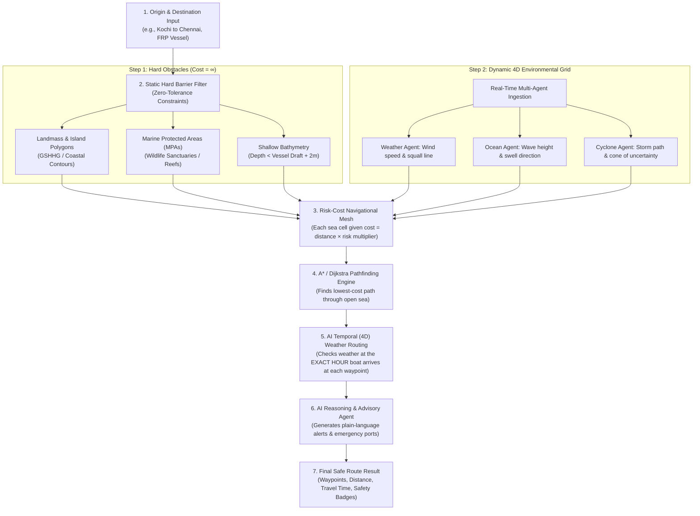

# ORCA Maritime Platform — Future Implementation Roadmap (`future.md`)

> **Document Status**: Production Blueprint & Future Architecture Specification  
> **Target Subsystems**: AI Service, Backend Processing Engine, GIS Pipelines, Alert Workers  
> **Last Updated**: September 2026

---

## 1. Executive Summary

This document captures all high-level architectures, dynamic AI agents, and pipeline capabilities planned for future releases of the **ORCA Maritime Advisory Platform**. 

While the system currently features a deterministic coastal waypoint engine, multi-agent analysis pipelines, real-time geofence validations, and interactive GIS visualization, the components outlined below detail the transition to a **4D spatio-temporal AI routing engine**, server-side pathfinding daemon, and automated broadcast infrastructure.

---

## 2. Complete Architectural Blueprint: 4D AI Maritime Routing with Automated Safety Checks

---

### Step 1: The Static Hard-Barrier Filter ($\text{Cost} = \infty$)
Before calculating path geometry, the system marks any cell that a boat **physically cannot enter** as an absolute barrier with infinite penalty ($\text{Cost} = \infty$):
1. **Landmass & Coastlines**: Coastal GIS shapefiles (GSHHG / OpenStreetMap coastline vectors) ensure the pathfinder cannot jump over islands, capes, or peninsulas.
2. **Marine Protected Areas (MPAs)**: Under Section 65 of maritime regulations, biological zones like Gulf of Mannar Biosphere Reserve and Gahirmatha Turtle Sanctuary have strict zero-tolerance prohibited boundaries.
3. **Bathymetric Depth Floor**: If a trawler requires a minimum draft of $2.5\text{ m}$, any shoal, reef, or sandbar shallower than $3.5\text{ m}$ (draft + $1.0\text{ m}$ keel safety margin) is blocked as solid obstacle.

---

### Step 2: Dynamic Risk-Cost Ocean Grid
For all navigable ocean water, the system builds a 2D/3D matrix where each coordinate cell is assigned a dynamic **Risk Cost Multiplier** calculated across specialized agents:

$$\text{Cell Traversal Cost} = \text{Distance} \times \Big( 1 + w_{\text{wave}}\cdot\text{Risk}_{\text{wave}} + w_{\text{wind}}\cdot\text{Risk}_{\text{wind}} + w_{\text{cyclone}}\cdot\text{Risk}_{\text{cyclone}} \Big)$$

- **Smooth Sea ($0.8\text{ m}$ waves, $10\text{ kt}$ breeze)**: Cost multiplier $\approx 1.0$ (direct corridor, maximum fuel efficiency).
- **Moderate Swell ($1.8\text{ m}$ waves)**: Cost multiplier $\approx 2.5$ (vessel slows down, uses more fuel).
- **High Squall / Rough Seas ($> 2.5\text{ m}$ waves)**: Cost multiplier $\approx 10.0$ (the algorithm automatically curves around the weather cell).
- **Cyclone Cone of Uncertainty**: Cost multiplier $= \infty$ (strictly prohibited entry).

---

### Step 3: $A^*$ Pathfinding with Cape Circumnavigation
The multi-objective $A^*$ algorithm searches through the connected sea grid:
- Evaluates candidate paths from Origin to Destination using a geodesic heuristic (Haversine/Vincenty).
- Automatically rejects any path intersecting land or prohibited MPAs.
- When traveling between the **West Coast (Arabian Sea)** and the **East Coast (Bay of Bengal)**, it discovers the lowest-cost water corridor looping south around **Cape Comorin (Kanyakumari)** through deep sea ($7.75^\circ\text{N}$).

---

### Step 4: 4D Temporal Weather Check (Time-Dependent Routing)
Marine weather is non-static. A coastal sector calm at 06:00 AM may experience violent squalls by 18:00 PM. The 4D engine calculates the vessel's arrival time at each subsequent waypoint:

$$t_{\text{waypoint}} = t_{\text{departure}} + \sum_{i=1}^{k} \frac{\Delta d_i}{V_{\text{vessel}}}$$

- **Temporal Forecast Matching**: Queries the wave and wind vector forecast for $t_{\text{waypoint}}$ rather than $t_{\text{departure}}$.
- **Dynamic Diversion**: If an offshore squall develops at hour 8 of a voyage, the pathfinder shifts waypoints $15\text{ NM}$ westward into calmer water or advises a departure delay window.

---

### Step 5: AI LLM Natural-Language Synthesis
Once geometry and waypoints are calculated, the AI Reasoning Agent (Gemini) generates an operational briefing:
1. **Navigable Waypoints**: Ordered coordinates with compass headings and expected speeds.
2. **Emergency Safe Havens**: Automatically identifies fallback harbors along the voyage (e.g., Neendakara, Vizhinjam, Tuticorin) in case of sudden squalls, engine distress, or medical emergencies.
3. **Operational Fuel & Speed Guidance**: Advises optimal engine RPM and throttle reduction zones for crossing high-swell regions like the Gulf of Mannar.

---

## 3. Pending System Roadmap & Future Implementations

### A. AI Service Backend Route Engine (`route/pathfinder.py`)
- **Current State**: Frontend handles client-side maritime navigation via `nauticalRouting.js`; backend queues requests with `status: 'queued'`.
- **Future Implementation**:
  - Implement `ai-service/app/route/cost_grid.py` to generate NumPy array cost matrices from INCOIS and GEBCO rasters.
  - Implement `ai-service/app/route/pathfinder.py` to execute NumPy-vectorized $A^*$ on the server.
  - Integrate `route_agent` directly into `ai-service/app/pipeline/executor.py` so that routes are automatically computed, enriched with risk scores, and saved as permanent MongoDB documents in `routes` collection.

---

### B. High-Resolution Bathymetry & Seabed Pipeline
- **Current State**: Static depth thresholding based on coastal gazetteer distance.
- **Future Implementation**:
  - Ingest **GEBCO 15-arc-second Global Bathymetry Grid** and Indian Hydrographic Office (NHO) electronic nautical charts (ENCs).
  - Spatial KD-Tree index for sub-second seabed clearance lookups at any arbitrary latitude/longitude.
  - Dynamic vessel draft calibration: FRP craft ($0.8\text{ m}$ draft), mechanized trawler ($2.8\text{ m}$ draft), deep-sea cargo/tug ($6.0\text{ m}$ draft).

---

### C. Automated Broadcast & Push Alert Workers (§70 Subscriptions)
- **Current State**: Alert subscriptions are created and saved in MongoDB (`subscriptions` collection).
- **Future Implementation**:
  - Background Celery / Redis worker evaluating active subscriptions every 15 minutes against live INCOIS High Wave Alerts and IMD Cyclone bulletins.
  - Push notification channels:
    - **SMS Gateway**: Integrated with local telecom APIs for basic 2G feature phones.
    - **WhatsApp Business API**: Rich alerts with localized safety maps and audio notes.
    - **NavIC / ISRO Satellite Broadcast Receiver**: Long-range satellite broadcast for vessels operating beyond 15–20 nautical miles outside cellular coverage.

---

### D. Multi-Lingual Regional Voice Synthesis
- **Current State**: Web Speech API text-to-speech for alerts in English and Hindi.
- **Future Implementation**:
  - Fine-tuned coastal dialect models for:
    - **Malayalam** (Kerala coastal dialect).
    - **Tamil** (Tuticorin, Rameswaram, Chennai fishing vernacular).
    - **Telugu** (Visakhapatnam, Kakinada coastal community dialect).
    - **Marathi / Gujarati / Bengali / Odia**.
  - Local offline compressed audio cache for critical distress advisories without active internet connection.

---

### E. Low-Bandwidth Progressive Web App (PWA) Offline Engine
- **Current State**: Interactive web SPA hosted on port 5173 with Vite.
- **Future Implementation**:
  - Service Worker offline tile cache (mbtiles vector format) covering the Indian EEZ up to 200 nautical miles.
  - Full local IndexedDB synchronization of historical routes, geofence polygons, and emergency contact frequencies.

---

### F. At-Sea Physical Hardware Feed & Automated Distress Protocol (Vessel Deployment)

#### 1. Physical Hardware Feed (NMEA-0183 / NMEA-2000 / AIS Serial Stream)
- **Objective**: Direct integration with onboard marine hardware without manual coordinate entry.
- **Architecture**:
  - **Web Serial API & Serial-over-WebSocket Daemon**: Connects physical GPS receivers, NavIC dongles, and marine plotters directly to the ORCA cockpit via USB or RS-422 serial adapters.
  - **NMEA Parser Engine**: Real-time decoding of standard marine sentences:
    - `$GPGGA` / `$GNGGA`: Fix quality, latitude, longitude, and satellite count.
    - `$GPRMC` / `$GNRMC`: Speed over ground (SOG), course over ground (COG), and UTC timestamp.
    - `$GPVTG`: Track made good and ground speed in knots.
  - **AIS Class-B Transponder Stream**: Parses AIVDM / AIVDO packets for live proximity detection to commercial container ships, tankers, and coastal naval patrols.

#### 2. Offline Marine Tile Pack (Deep-Sea PWA Offline Mode)
- **Objective**: 100% autonomous operation beyond cellular 4G/5G mobile tower range ($> 15 - 20\text{ NM}$ offshore).
- **Architecture**:
  - **Offline Vector Tiles**: Pre-downloads high-compression vector tile packages (`.pmtiles` / `.mbtiles`) covering the Indian EEZ and neighboring international boundaries.
  - **Client-Side Spatial Indexing**: Bundles lightweight GeoJSON / FlatGeobuf boundary definitions inside browser IndexedDB, allowing spatial point-in-polygon queries to execute locally on the boat's device with zero internet connection.

#### 3. Automated Coast Guard Distress Relay (MRCC Emergency Protocol)
- **Objective**: Life-saving automated intervention when artisanal fishermen stray across sensitive maritime borders.
- **Architecture**:
  - **Automatic Breach Escalation Timer**: If a vessel breaches an International Maritime Boundary Line (e.g., India-Sri Lanka IMBL or Sir Creek) and maintains a violating vector for $> 3\text{ minutes}$ without course alteration, the system escalates from local audio sirens to external emergency broadcast.
  - **VHF DSC / Satellite Distress Broadcast**:
    - Generates standard maritime distress NMEA sentences for VHF Digital Selective Calling (DSC Channel 70).
    - Bridges to NavIC / INSAT MSS (Mobile Satellite Service) transceivers to transmit an automated SOS distress packet directly to the Indian Coast Guard Maritime Rescue Coordination Centre (MRCC Chennai, Mumbai, or Port Blair) with exact vessel registration, coordinates, bearing, and crew count.

---

## 4. Implementation Priority Matrix

| Phase | Milestone | Primary Deliverable | Target System |
| :--- | :--- | :--- | :--- |
| **Phase 1** | **Server-Side Python Pathfinder** | `cost_grid.py` + `pathfinder.py` + MongoDB Route persistence | `ai-service` + `backend` |
| **Phase 2** | **4D Dynamic Weather Grid** | Hourly INCOIS wave assimilation into cost grid | `ai-service/app/agents` |
| **Phase 3** | **Alert Broadcast Worker** | Celery cron worker + SMS / WhatsApp notification gateway | `backend/src/workers` |
| **Phase 4** | **GEBCO Bathymetry Grid** | 15-arc-second depth raster clipping & clearance checks | `ai-service/app/gis` |
| **Phase 5** | **Offline Marine Tile Pack (PWA)** | Service Worker vector tiles & IndexedDB spatial cache | `frontend` |
| **Phase 6** | **NMEA Serial & NavIC Hardware Feed** | Web Serial NMEA 0183/2000 parser & AIS Class-B ingestion | `frontend` + IoT Bridge |
| **Phase 7** | **Automated MRCC Distress Ping** | VHF DSC / NavIC MSS satellite auto-SOS relay | `backend/src/workers` + Hardware |
| **Phase 8** | **Dual-Pipeline Conversational Copilot** | Context-aware dashboard follow-up (`stored_evidence`) & fresh-start coastal advisory | `frontend` + `backend/src/modules/chat` |

---

## 5. Upcoming Subsystem Enhancements & Operational Test Plans

### A. End-to-End Multi-Agent Analysis Pipeline & Synthetic Stress Suite
- **Scope**: Comprehensive validation of the 5-agent AI pipeline (Weather, Ocean, Cyclone, Hazard, and Decision).
- **Architecture**:
  - **Automated Coastal Quadrant Stress Suite**: Synthetic batch verification across all 9 Indian coastal states and island territories (Kochi, Mangalore, Rameswaram, Visakhapatnam, Paradip, Mumbai, Porbandar, Port Blair, Kavaratti).
  - **SSE Telemetry Streaming Verification**: Real-time heartbeat and progress monitoring over Server-Sent Events from port 4000 to port 5173 without buffer delays or disconnections.
  - **Explainable Safety Score Audit**: Cross-agent consistency validation verifying that high wave warnings ($> 3.0\text{ m}$) or active cyclone cones strictly correlate with **DO NOT GO TO SEA** decisions and plain-language vernacular summaries.

### B. Dynamic Route Weather Assimilation & Passage Risk Profiling
- **Scope**: Transforming static geodesic routes into active weather-aware navigational tracks.
- **Architecture**:
  - **Per-Waypoint Weather Interpolation**: Interpolating significant wave height ($H_s$), swell period, wind speed, and squall vectors at each discrete passage waypoint along the computed route.
  - **Passage Segment Visual Risk Graph**: Color-coded route vectors (Green = Calm, Amber = Moderate Swell, Red = Violent Squall) directly on the Leaflet navigation canvas.
  - **Automated Weather Detour Alerts**: Recommends dynamic waypoint shifts (e.g. $10 - 15\text{ NM}$ closer to coast or fallback port entry) when an offshore storm develops during transit.

### C. Interactive GIS Maritime Infrastructure & Bathymetry Layer Explorer
- **Scope**: Full spatial awareness cockpit combining coastal infrastructure and marine limits.
- **Architecture**:
  - **Comprehensive Multi-Layer Overlay**: Simultaneous rendering and filtering of all 20+ active GIS layers (Marine Protected Areas, Sovereign Indian EEZ, Mumbai High ODAG Oil Rigs, 50+ major ports, and fishing harbours).
  - **Live Vessel Tracking on GIS**: Real-time GPS vessel position marker integrated directly into the global GIS canvas.
  - **User GeoJSON / KML Import Tool**: Allows fisheries cooperatives, harbor authorities, and operators to upload custom spatial zones (e.g., local aquaculture cages, community fishing quadrants, temporary naval firing zones).

### D. Omni-Channel Alert Notification Delivery Workers (§70 Subscriptions)
- **Scope**: Closing the loop between safety intelligence and active fishermen at sea.
- **Architecture**:
  - **Automated Background Celery Worker**: Polls INCOIS and IMD live RSS/JSON feeds every 15 minutes and matches bounding boxes against user subscription quadrants.
  - **Multi-Channel Push Pipeline**:
    - **2G SMS Gateway**: Ultra-concise, bandwidth-friendly SMS alerts for basic feature phones.
    - **WhatsApp Business API**: Rich interactive safety cards with localized map snapshots and voice audio notes.
    - **Browser Web Push Notifications**: Service Worker push triggers with audio alert chimes.

### E. Web Serial NMEA GPS Hardware Plug-and-Play Feed
- **Scope**: Direct onboard marine GPS puck and NavIC transponder connectivity.
- **Architecture**:
  - **Web Serial API Native Driver**: "Connect GPS Device" button in the At-Sea Guard cockpit allowing fishermen to connect USB or Bluetooth marine GPS pucks with a single click.
  - **Client-Side Sentence Stream Parser**: Decodes raw `$GPRMC`, `$GPGGA`, and `$GPVTG` marine sentences at 1 Hz, automatically updating vessel coordinates, speed in knots, and heading without any manual typing.
  - **Automatic Reconnect & Fallback**: Automatically restores serial streams upon cable reconnection and gracefully falls back to browser geolocation if hardware disconnects.

### F. Dual-Pipeline Conversational Copilot (Context-Aware Dashboard Follow-Up & Fresh-Start Advisory)
- **Scope**: Enhancing the floating Ask ORCA Copilot (`MaritimeChat.jsx` / `chat.service.js`) with intelligent bifurcated pipelines for general ocean risk and coastal operations.
- **Architecture**:
  - **Mode 1: Context-Aware Dashboard Follow-Up (`answered_from: 'stored_evidence'`)**:
    - When the user runs an analysis on the dashboard and then opens the copilot, the active `analysis_id` is automatically bound to the chat session.
    - **Sub-Second Response**: Instead of dispatching a heavy 9-point Planner grid, the conversational agent reads already-computed oceanographic telemetry (Copernicus waves, currents, wind gusts, risk scores, safe points) directly from stored evidence.
    - Answers operational follow-up questions immediately: *"Why is point P2 safer than P5?"*, *"What are the wave conditions expected at 16:00?"*, *"Are there any boundary hazards along this route?"*.
  - **Mode 2: Fresh-Start Coastal Advisory & Multi-Stakeholder Ingestion**:
    - When accessed directly without prior dashboard analysis (`analysis_id: null`).
    - **Proactive Location Clarification**: Instead of assuming a fixed default baseline location (e.g. Kochi), if the user initiates a trip or mission query without a location (*"I want to go on a research survey"* or *"Can I go boating?"*), the copilot politely prompts:
      > *"I'd be glad to help plan your coastal mission! Which coastal area or port will you be departing from? (e.g., Mumbai, Chennai, Kochi, Visakhapatnam, Goa)"*
    - **General Oceanography & Hazard Explanations**: Answers procedural questions (*"What is a Kallakkadal swell surge?"*, *"What precautions should coastal operators take during a squall warning?"*, *"How are rip currents formed?"*) instantly without requiring coordinates or grid dispatch.
    - **Multi-Activity Sensitivity**: Detects non-fishing marine activities (`tourism`, `boating`, `diving`, `surfing`, `shipping`, `marine_research`) and configures dynamic risk tolerances accordingly.

